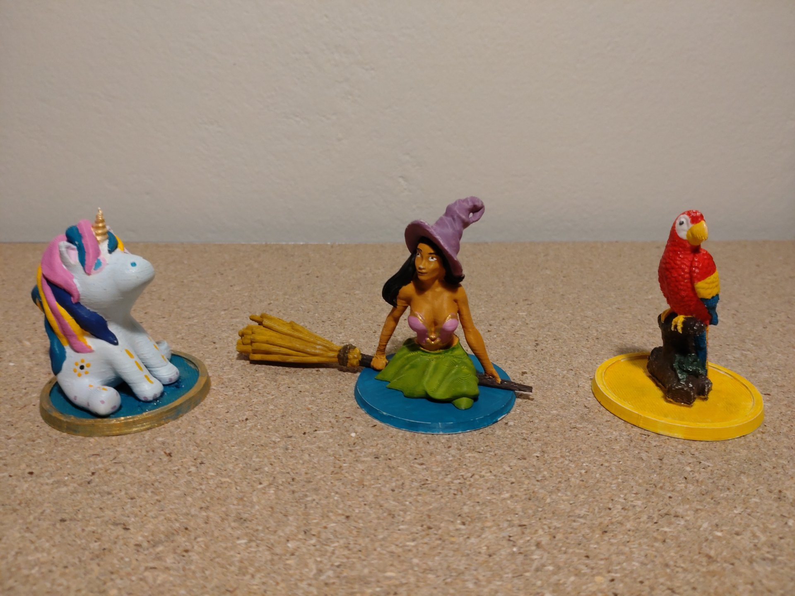

# 3D Models for audio cubes

The included `base.stl` file can be used as the base and to attach the NFC sticker.
It can be printed in about 20min in an FDM printer. Some **infill is required.**

## List of easy to print models

- Parrot: https://www.thingiverse.com/thing:2775235
- Elephant: https://www.thingiverse.com/thing:932447
- Chubby Dragon: https://www.myminifactory.com/object/3d-print-chubby-dragon-83785
- Unicorn: https://cults3d.com/en/3d-printing/powderpuff-unicorn-brim3d
- Mountain: https://cults3d.com/en/3d-model/game/puzzling-mountain
- Witch: https://www.thingiverse.com/thing:5023840

