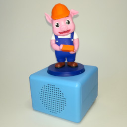
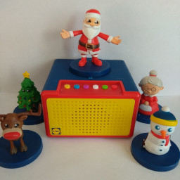

# audiocube

Software toolbox for a few similar devices I call "audio cubes": More or less cube-shaped audio players with an integrated speaker, that will automatically start playing fairytales from their internal memory when one of the affiliated figures (containing a hidden NFC tag) is placed on top of the device.

The following devices are currently supported *(click on picture or ID for more information)*:

Picture | ID | Name | Description
--- | --- | --- | ---
 | [hachette](devices/hachette/) | *(Various)* | Sold in multiple european countries under localized names: - "*Märchenheld*" in Germany - "*Hxografhmena Paramythia*" in Greece - "*[Opowiadajki](https://opowiadajki.pl/)*" in Poland
 | [storyland](devices/storyland/) | LIDL Storyland | Sold by LIDL in Greece
[(No image yet)](devices/storybox/) | [storybox](devices/storybox/) | Migros Storybox | Sold by Migros in Switzerland

Please visit (https://oyooyo.github.io/audiocube)[https://oyooyo.github.io/audiocube] for more information.
