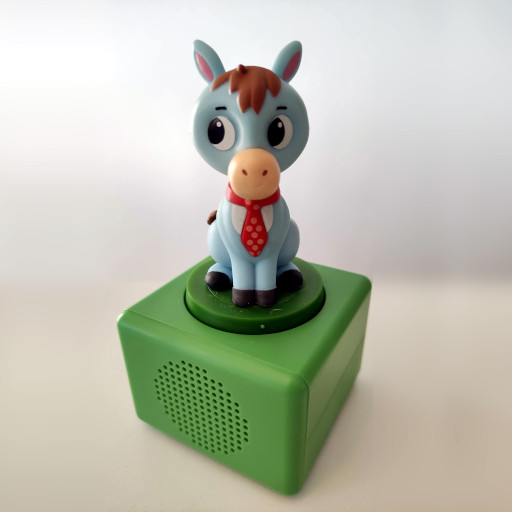

# hachette



## Program usage

### Show general command overview

```sh
$ audiocube.py hachette_green -h
usage: audiocube.py hachette_green [-h] {encrypt,decrypt,create_nfc_file} ...

Toolbox for "Hachette (Green version)"

positional arguments:
  {encrypt,decrypt,create_nfc_file}
                        The command to execute

optional arguments:
  -h, --help            show this help message and exit
```

### Encrypt/Convert .mp3 files to .smp

To encrypt/convert .mp3 file(s) to the .smp format, use the `encrypt` command:

```sh
$ audiocube.py hachette_green encrypt -h
usage: audiocube.py hachette_green encrypt [-h] [--output_file_pattern OUTPUT_FILE_PATTERN] input_file [input_file ...]

Encrypt audio file(s)

positional arguments:
  input_file            The input file(s) to read from

optional arguments:
  -h, --help            show this help message and exit
  --output_file_pattern OUTPUT_FILE_PATTERN, -ofp OUTPUT_FILE_PATTERN
                        Pattern for the output filenames (default: {name}.smp)
```

For example, to encrypt/convert files T0010.mp3 and T0011.mp3 to T0010.smp and T0011.smp:

```sh
$ audiocube.py hachette_green encrypt T0010.mp3 T0011.mp3
"T0010.mp3" -> "T0010.smp"
"T0011.mp3" -> "T0011.smp"
```

### Decrypt/Convert .smp files to .mp3

To decrypt/convert .smp file(s) to the .smp format, use the `decrypt` command:

```sh
$ audiocube.py hachette_green decrypt -h
usage: audiocube.py hachette_green decrypt [-h] [--output_file_pattern OUTPUT_FILE_PATTERN] input_file [input_file ...]

Decrypt audio file(s)

positional arguments:
  input_file            The input file(s) to read from

optional arguments:
  -h, --help            show this help message and exit
  --output_file_pattern OUTPUT_FILE_PATTERN, -ofp OUTPUT_FILE_PATTERN
                        Pattern for the output filenames (default: {name}.mp3)
```

For example, to decrypt/convert files T0010.smp and T0011.smp to T0010.mp3 and T0011.mp3:

```sh
$ audiocube.py hachette_green decrypt T0010.smp T0011.smp
"T0010.smp" -> "T0010.mp3"
"T0011.smp" -> "T0011.mp3"
```

### Create a compatible NFC tag

#### Step 1: Create a .mct file

The [docs/devices/hachette_green/nfc](https://github.com/oyooyo/audiocube/tree/master/docs/devices/hachette_green/nfc) directory contains ready-to-use `.mct` files that should be sufficient if you just want to create a backup NFC tag for an existing figure, in which case you can skip this step. If however you want to create your own fairytales, you should follow this section to create your own custom NFC tag for this fairytale.

To create a compatible NFC tag, start by using the `create_nfc_file` command:

```sh
$ audiocube.py hachette_green create_nfc_file -h
usage: audiocube.py hachette_green create_nfc_file [-h] file_id [name]

Create a NFC tag content file, in order to create a compatible ("Mifare Classic") NFC tag via the "MIFARE Classic Tool" (https://play.google.com/store/apps/details?id=de.syss.MifareClassicTool) smartphone
app

positional arguments:
  file_id     The file ID, a hexadecimal string in range 0000...FFFF
  name        The name/label for this NFC tag. Determines the output file name. Optional, defaults to "TMB-ABC_T{file_id}" (default: None)

optional arguments:
  -h, --help  show this help message and exit
```

For example, to create a NFC tag that will play audio file `T0023.smp` in directory `TMB-ABC`:

```sh
$ audiocube.py hachette_green create_nfc_file 0023
```

The above command will create a file called `TMB-ABC_T0023.mct`.

#### Step 2: Write the .mct file to a *Mifare Classic* NFC tag

In order to actually create the NFC tag from the `.mct` file created in step 1, you need to perform the following steps afterwards:

1. Install the free and open source "[MIFARE Classic Tool](https://play.google.com/store/apps/details?id=de.syss.MifareClassicTool)" smartphone app, if you haven't done so yet
2. Copy the `.mct` file created in step 1 to directory `/sdcard/MifareClassicTool/dump-files/` on your Android smartphone
3. Open the "[MIFARE Classic Tool](https://play.google.com/store/apps/details?id=de.syss.MifareClassicTool)" app
4. Click "*Write Tag*"
5. Click "*Write Dump (Clone)*", then "*Select Dump*"
7. Choose the `.mct` file that you created in step 1, then click "*Select Dump*"
8. Hold the "*Mifare Classic*" NFC tag that you want to write to the location of the NFC reader on the back of your smartphone. You should here a tone and a "*New Tag found (UID:xxxxxxxx)*" message should be displayed
9. Keep the NFC tag in this position, click "*OK*", then "*Start mapping and write dump*"

## Files

### Filesystem

ToDo

### MP3 File format

The device doesn't seem to be very picky about the MP3 files. The files on the german version are encoded at 48kHz Stereo @ 320kbit.

### Encryption

The MP3 files the device plays are encrypted with a simple algorithm:
1. The whole file is then XORed with the byte array \[0x18, 0x08, 0x20, 0x20\]

## NFC Tags

The device uses `Mifare Classic 1k` NFC tags.

## Photos


## Credits

"**Cean D.**" provided information about the device, the figures and the NFC tags
"**Nikolas M.**" provided a nice photo of the device and information about the device
