# Migros Storybox

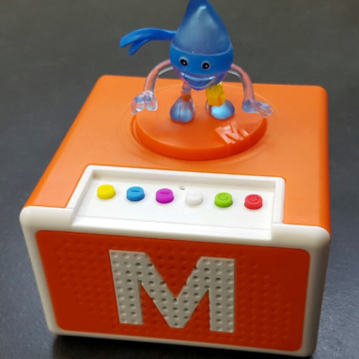

ToDo

## Links

- Stephan Schori has [a fantastic website dedicated to this device](http://www.revox.name/technology/storymania/) which describes pretty much every aspect of this device. He also offers a great little GUI tool (written in Java) for converting between .smp <-> .mp3 files compatible with the Migros device.

## Photos

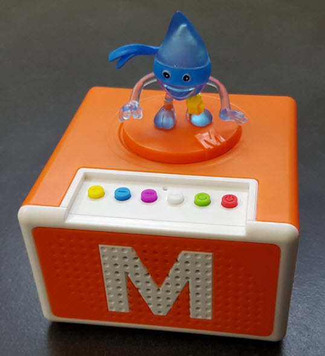
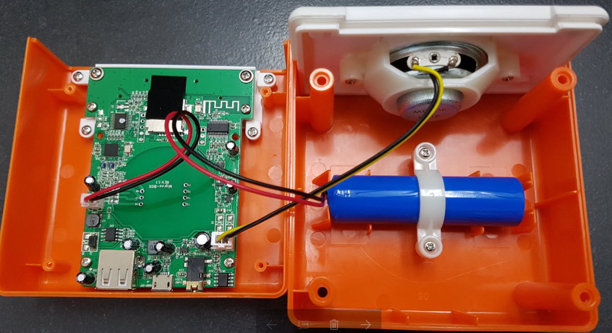
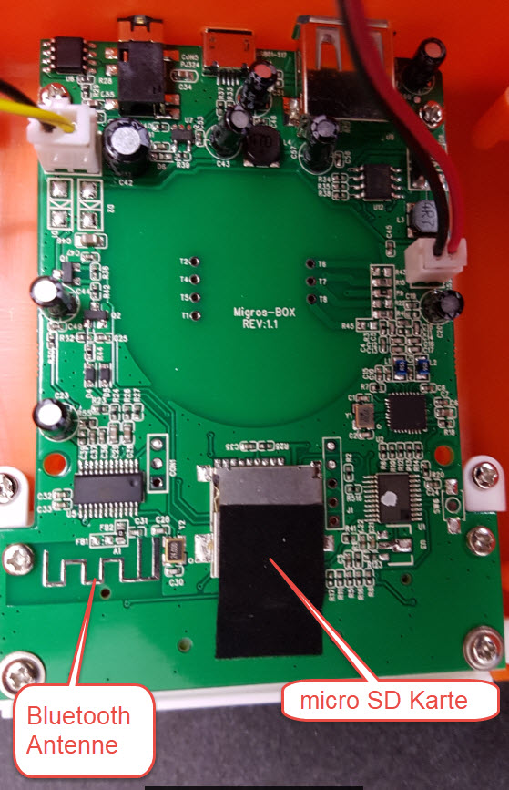
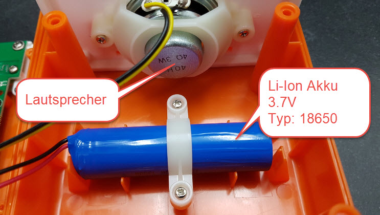
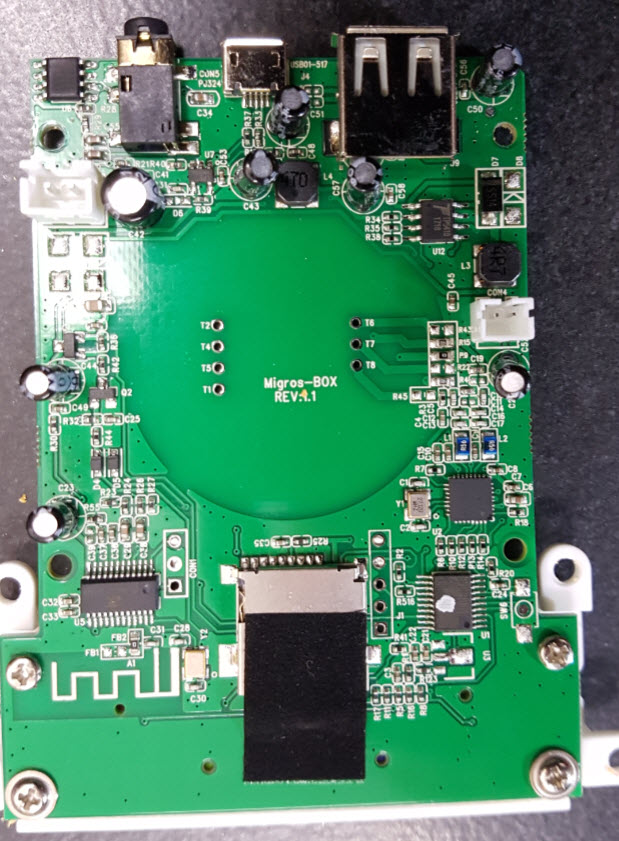
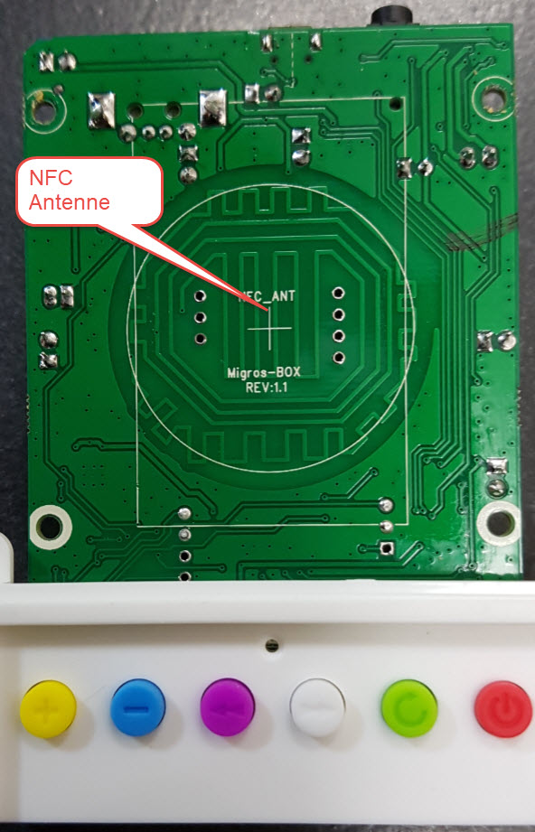
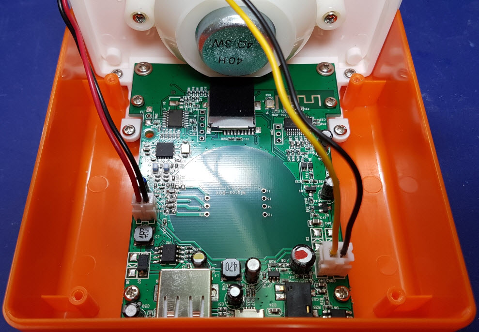

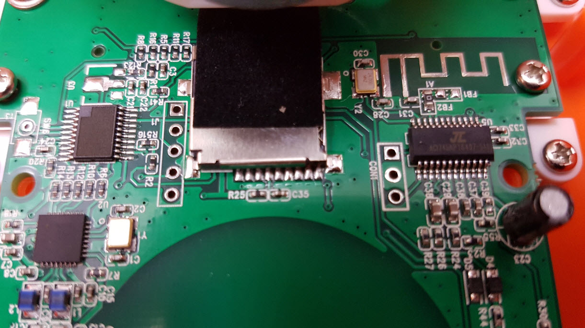
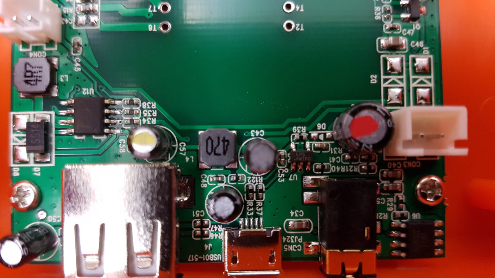
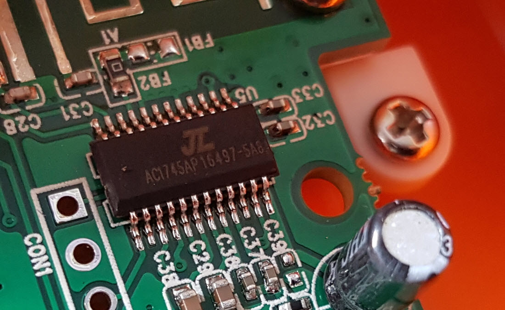
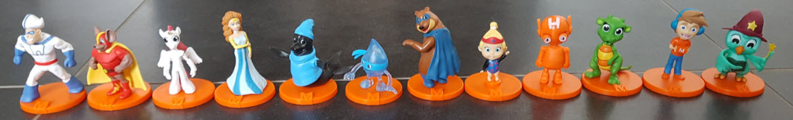
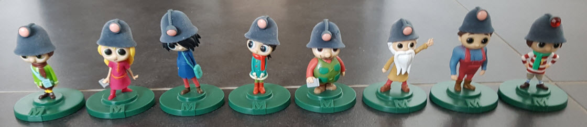
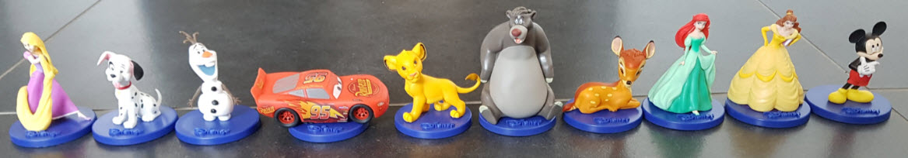

## Credits

- [Stephan Schori](http://www.revox.name/) pretty much discovered and provided all information, the photos etc. that is available about the device
