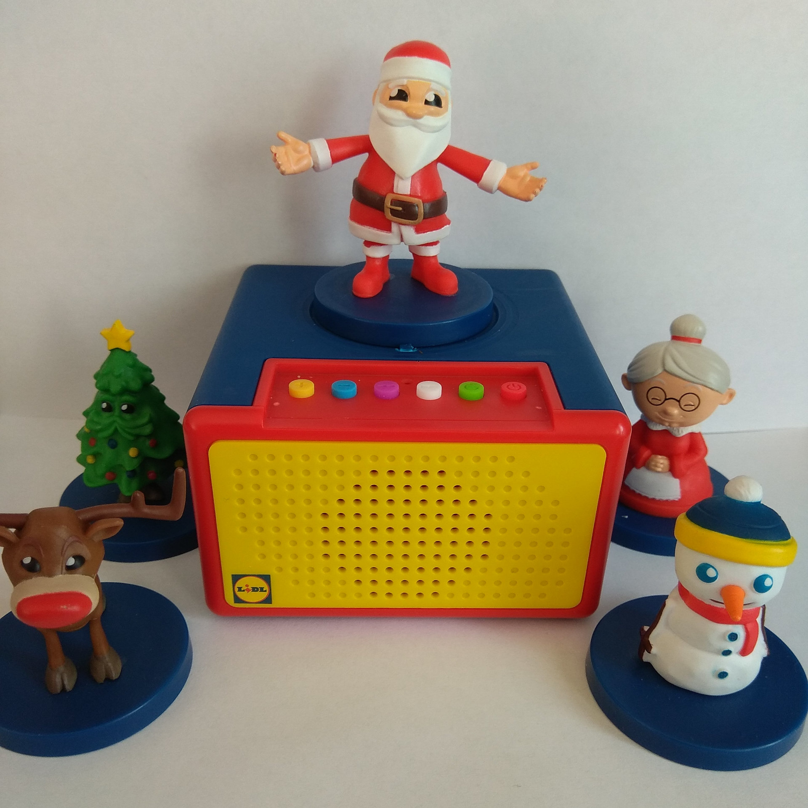
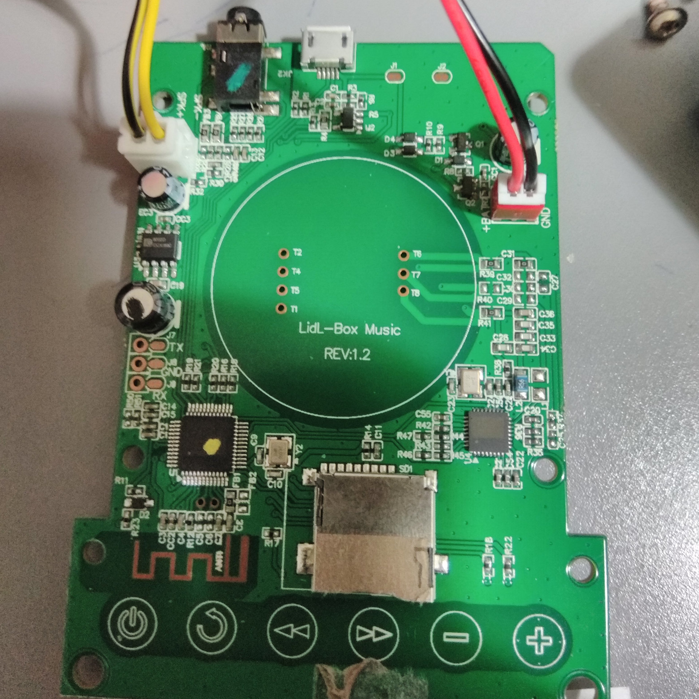
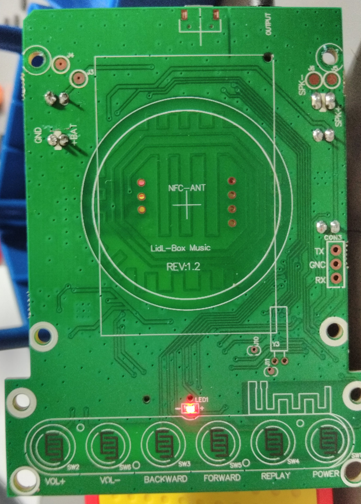

# LIDL Storyland


The "[LIDL Storyland](https://www.lidl-hellas.gr/storyland)" is a device sold in greek LIDL stores for 9,99 €.

## NFC Tag Writer WebApp

If you want to create your own NFC tags/figures, for example because you want to add your own fairy tales and create your own associated figures that will trigger their playback, then there are multiple ways to achieve this. Probably the easiest way is by using a small WebApp that was made for this purpose.

To use it...
1. Visit the [LIDL Storyland NFC Tag Writer website](https://oyooyo.github.io/audiocube/devices/storyland/nfc_webapp/) on an Android smartphone with NFC and Chrome webbrowser
2. *Either* select one of the predefined NFC tags (in case you want to create a NFC tag that triggers the playback of one of the official fairy tales by LIDL) *or* enter a custom four-character file ID
3. Click on the "*Write NFC Tag*" button
4. Place a NTAG213 NFC tag on your smartphone's NFC reader

The only problem with this approach is that it requires Chrome v89 or later, but the current official/stable version is still v88 right now. So you need to either wait a few weeks for Chrome v89 becoming the official/stable version, or install [Chrome Dev](https://play.google.com/store/apps/details?id=com.chrome.dev).

## Program usage

### Show general command overview

```sh
$ audiocube.py storyland --help
usage: audiocube.py storyland [-h] {encrypt,decrypt,create_nfc_file} ...

Toolbox for "LIDL Storyland"

positional arguments:
  {encrypt,decrypt,create_nfc_file}
                        The command to execute

optional arguments:
  -h, --help            show this help message and exit
```

### Encrypt/Convert .mp3 files to .SMP

To encrypt/convert .mp3 file(s) to the .SMP format that the files stored on the device need to have, use the `encrypt` command:

```sh
$ audiocube.py storyland encrypt --help
usage: audiocube.py storyland encrypt [-h] [--output_file_pattern OUTPUT_FILE_PATTERN] input_file [input_file ...]

Encrypt audio file(s)

positional arguments:
  input_file            The input file(s) to read from

optional arguments:
  -h, --help            show this help message and exit
  --output_file_pattern OUTPUT_FILE_PATTERN, -ofp OUTPUT_FILE_PATTERN
                        Pattern for the output filenames (default: {name}.SMP)
```

### Decrypt/Convert .SMP files to .mp3

To decrypt/convert .SMP file(s) stored on the device to regular MP3 file(s), use the "decrypt" command:

```sh
$ audiocube.py storyland decrypt --help
usage: audiocube.py storyland decrypt [-h] [--output_file_pattern OUTPUT_FILE_PATTERN] input_file [input_file ...]

Decrypt audio file(s)

positional arguments:
  input_file            The input file(s) to read from

optional arguments:
  -h, --help            show this help message and exit
  --output_file_pattern OUTPUT_FILE_PATTERN, -ofp OUTPUT_FILE_PATTERN
                        Pattern for the output filenames (default: {name}.mp3)
```

For example, to convert files L0010.SMP and L0011.SMP to L0010.mp3 and L0011.mp3:

```sh
$ audiocube.py storyland decrypt L0010.SMP L0011.SMP
"L0010.SMP" -> "L0010.mp3"
"L0011.SMP" -> "L0011.mp3"
```

### Create a custom NFC tag

This project contains [a directory](https://github.com/oyooyo/audiocube/tree/master/docs/devices/storyland/nfc) with several ready-to-use .csv files for creating NFC tags that will play the official fairy tales/audio files by LIDL.

If however you want to create custom NFC tags that play custom audio files created by yourself, you can use the `create_nfc_file` subcommand to create custom .csv files.

In both cases, these .csv files can then be used by the "NFC TagWriter by NXP" smartphone app in order to create/write the required NFC tags.

```sh
$ audiocube.py storyland create_nfc_file --help
usage: audiocube.py storyland create_nfc_file [-h] file_id [name]

Create a NFC tag content file, in order to create a compatible ("NTAG213") NFC tag via the "NFC TagWriter by NXP" (https://play.google.com/store/apps/details?id=com.nxp.nfc.tagwriter) smartphone app

positional arguments:
  file_id     The file ID, a four-character ASCII string
  name        The name/label for this NFC tag. Determines the output file name. Optional, defaults to "L{file_id}" (default: None)

optional arguments:
  -h, --help  show this help message and exit
```

For example, to create a NFC tag that will play audio file "L0014.SMP", and shows up as "Some description" in the "NFC TagWriter by NXP" app, use:

```sh
$ audiocube.py storyland create_nfc_file 14 "Some description"
```

This will create a file named `Some description.csv`. In order to actually create the NFC tag, you need to perform the following steps afterwards:
1. Copy the `.csv` file to your smartphone, for example via `adb push`, by emailing it to your smartphone or however. The directory where you store it on your smartphone should not matter.
2. Install the free [NFC TagWriter by NXP](https://play.google.com/store/apps/details?id=com.nxp.nfc.tagwriter) app on your NFC-enabled Android smartphone, if you haven't installed it yet.
3. Open the "NFC TagWriter by NXP" app.
4. On the main screen, click "Write tags"
5. Click "Write from CSV"
6. Select the created `.csv` file
7. Do as the app advises you.

## Files

The audio files that the device is able to play need to be stored on the MicroSD card built into the device. The device ships with a 4GB MicroSD card that initially contains 6 audio files.

### Filesystem

ToDo

### File format

When creating your own .smp files, you first need to modify the .mp3 files, otherwise the device will not play them. The device seems to support all kinds of MP3 bitrates and samplerates, but the MP3 files need to contain a ID3v2.3 tag with "L####" stored in the "title" field using UTF-16 encoding, where "#" can be any valid letter. The file may additionally contain a ID3v1 tag that can be used as one likes.

The free software "[Kid3](https://kid3.kde.org/)" for example can be used to do this.

### Encryption

They are standard MP3 files, but encrypted with a simple encryption algorithm:
1. For each byte in the MP3 file, the bits are rotated right by 3 bits (For example, 0b11010001 would become 0b00111010)
2. The whole file is then XORed with the byte array \[0x01, 0x80, 0x04, 0x04\]

## NFC Tags

ToDo

## Photos







## Credits

- [bserem](https://github.com/bserem) provided useful information about this and also the "Migros Storybox" device
- [cratsil1979](https://github.com/cratsil1979) provided lots of useful information, photos etc., details how to create compatible MP3 files etc.
- [Storylander](https://github.com/Storylander) discovered lots of extremely useful information, for example that the device can not only distinguish 100 different files, but millions
