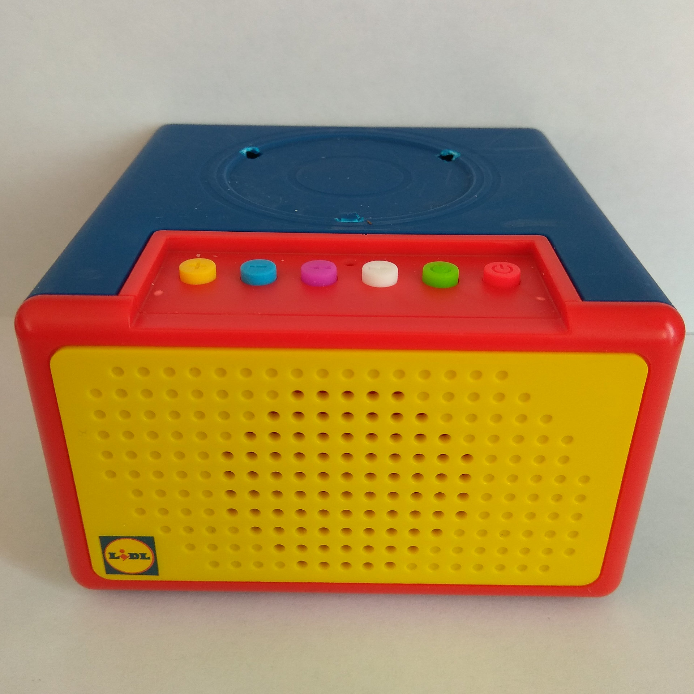
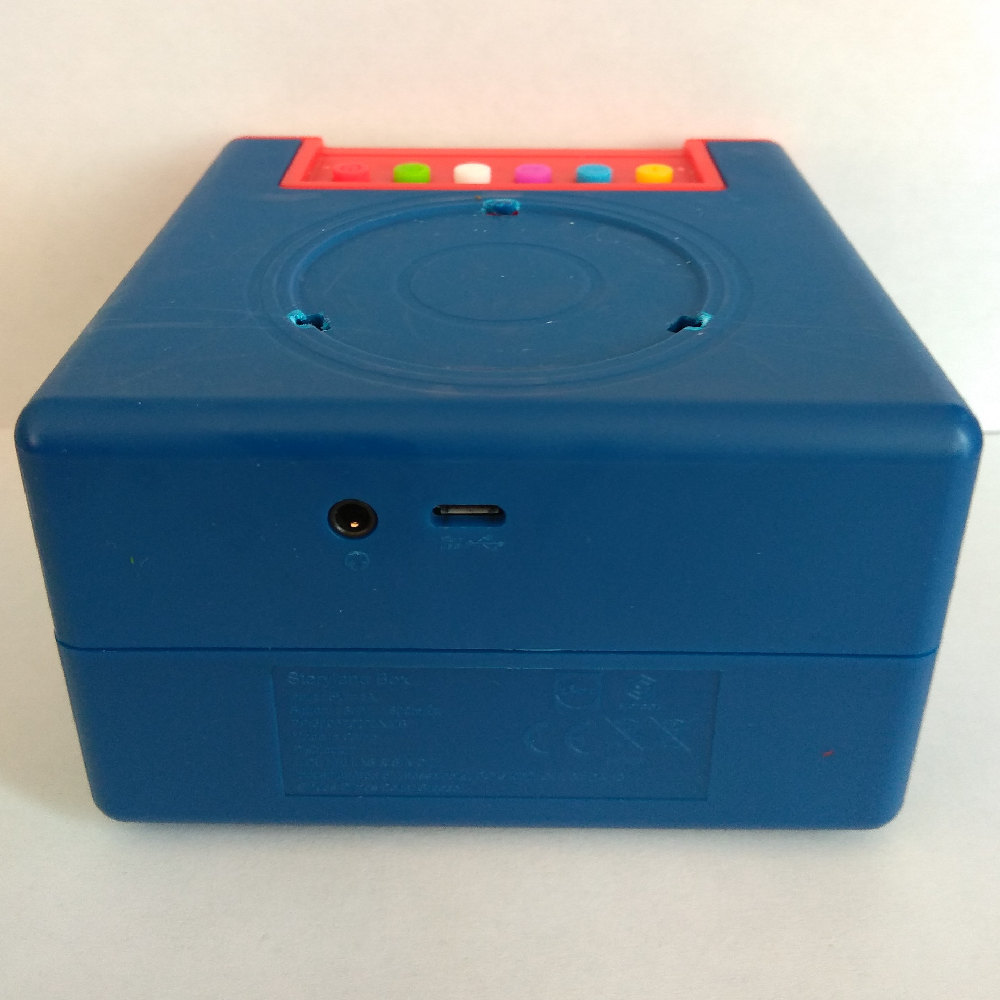

# LIDL Storyland


The "[LIDL Storyland](https://www.lidl-hellas.gr/storyland)" is a device sold in greek LIDL stores for 9,99 €. Figures are sold separately for 1,99 € each.

## Program usage

```sh
$ audiocube.py storyland --help
usage: audiocube.py storyland [-h] {encrypt,decrypt} ...

Toolbox for "LIDL Storyland"

positional arguments:
  {encrypt,decrypt}  The command to execute

optional arguments:
  -h, --help         show this help message and exit
```

### Encrypt/Convert .mp3 files to .SMP

To encrypt/convert .mp3 file(s) to the .SMP format that the files stored on the device need to have, use the "encrypt" command:

```sh
$ audiocube.py storyland encrypt --help
usage: audiocube.py storyland encrypt [-h] [--output_file_pattern OUTPUT_FILE_PATTERN] input_file [input_file ...]

Encrypt audio file(s)

positional arguments:
  input_file            The input file(s) to read from

optional arguments:
  -h, --help            show this help message and exit
  --output_file_pattern OUTPUT_FILE_PATTERN, -ofp OUTPUT_FILE_PATTERN
                        Pattern for the output filenames (default: {name}.SMP)
```

For example, to convert files L0010.mp3 and L0011.mp3 to L0010.SMP and L0011.SMP:

```sh
$ audiocube.py storyland encrypt L0010.mp3 L0011.mp3
"L0010.mp3" -> "L0010.SMP"
"L0011.mp3" -> "L0011.SMP"
```

### Decrypt/Convert .SMP files to .mp3

To decrypt/convert .SMP file(s) stored on the device to regular MP3 file(s), use the "decrypt" command:

```sh
$ audiocube.py storyland decrypt --help
usage: audiocube.py storyland decrypt [-h] [--output_file_pattern OUTPUT_FILE_PATTERN] input_file [input_file ...]

Decrypt audio file(s)

positional arguments:
  input_file            The input file(s) to read from

optional arguments:
  -h, --help            show this help message and exit
  --output_file_pattern OUTPUT_FILE_PATTERN, -ofp OUTPUT_FILE_PATTERN
                        Pattern for the output filenames (default: {name}.mp3)
```

For example, to convert files L0010.SMP and L0011.SMP to L0010.mp3 and L0011.mp3:

```sh
$ audiocube.py storyland decrypt L0010.SMP L0011.SMP
"L0010.SMP" -> "L0010.mp3"
"L0011.SMP" -> "L0011.mp3"
```

## Files

The audio files that the device is able to play need to be stored on the MicroSD card built into the device. The device ships with a 4GB MicroSD card that initially contains 6 audio files.

### Filesystem

ToDo

### File format

The audio files that the device plays are ultimately MP3 files. The device is a bit picky though and will not simply play all MP3 files. It is not 100% clear yet what characteristics a MP3 file needs to have to be compatible, but here's a few hints:

- The audio files shipped with the device use a sample rate of 44100 Hz, so that sample rate should be safe to use
- The device *might* have problems playing MP3 files with ID3 metadata in the latest version v2.4. The audio files shipped with the device seem to use ID3 version v2.3 instead, so if you have the possibility, it might be a good idea to use ID3v2.3 as well just to avoid any potential problems.
- It might be necessary to store the filename (without extension, for example "L0016") in the title field of the ID3v2 tag

See [here](https://github.com/oyooyo/audiocube/issues/1#issuecomment-750953311) for more information.

### Encryption

They are standard MP3 files, but encrypted with a simple encryption algorithm:
1. For each byte in the MP3 file, the bits are rotated right by 3 bits (For example, 0b11010001 would become 0b00111010)
2. The whole file is then XORed with the byte array \[0x01, 0x80, 0x04, 0x04\]

## NFC Tags

ToDo

## Photos





## Credits

- [bserem](https://github.com/bserem) provided useful information about this and also the "Migros Storybox" device
- [cratsil1979](https://github.com/cratsil1979) provided lots of useful information, photos etc., details how to create compatible MP3 files etc.
